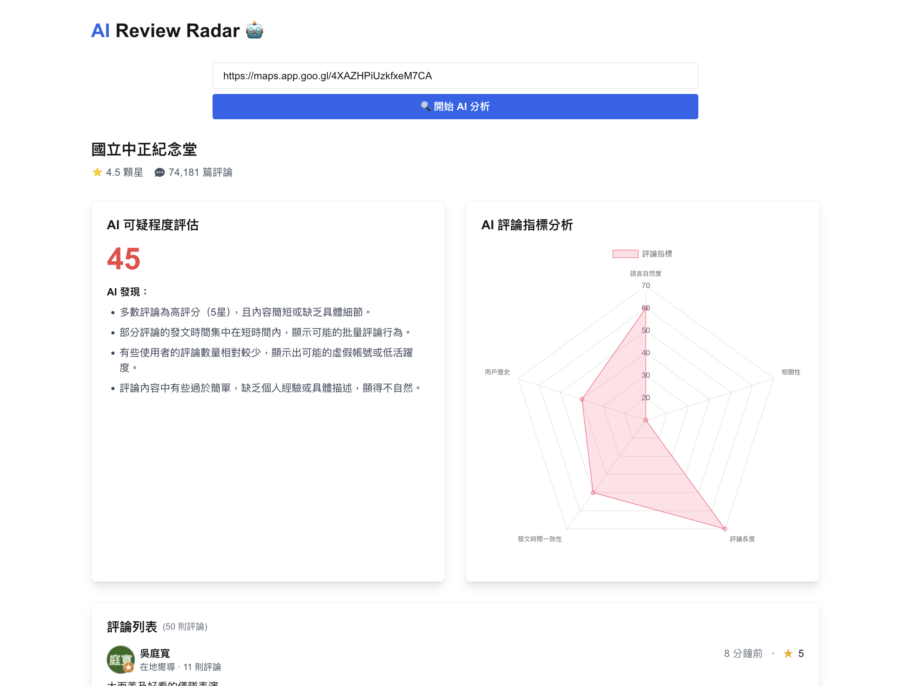

# AI Review Radar 

[](https://nextjs.org/)
[](https://reactjs.org/)
[](https://tailwindcss.com/)

AI Review Radar is a comprehensive review management tool that combines review analysis and generation capabilities. It leverages advanced AI technology to analyze Google Maps reviews for potential fake reviews and generates personalized review responses based on historical data.



## Key Features

### 1. Review Analysis
- **Review Scraping**: Automatically extracts reviews from any Google Maps location
- **AI-Powered Analysis**: Uses advanced AI models to analyze review patterns and detect suspicious activities
- **Comprehensive Metrics**: Provides detailed analysis through multiple dimensions:
  - Language Naturalness (0-100)
  - Content Relevance (0-100)
  - Comment Length Pattern (0-100)
  - Posting Time Consistency (0-100)
  - User Activity (0-100)
- **Real-time Processing**: Delivers instant results with visual representations
- **Multi-language Support**: Works with reviews in various languages

### 2. Review Generation
- **Personalized Responses**: Generates tailored reviews based on user profiles
- **Sentiment Analysis**: Supports positive, neutral, and negative review generation
- **Historical Data Integration**: Utilizes historical review data for more authentic responses
- **Multi-language Generation**: Supports review generation in multiple languages

## Technical Details

### Review Analysis Process
1. **Data Collection**
   - Accepts Google Maps short URLs or full URLs
   - Uses Puppeteer to scrape reviews, including:
     - User information
     - Review content
     - Ratings
     - Timestamps
     - Photos
     - Local Guide status

2. **AI Analysis Process**
   - Analyzes writing style consistency
   - Detects machine-generated or templated content
   - Evaluates language patterns and expressions
   - Assesses content relevance to business type
   - Checks for generic vs. specific details
   - Identifies location-specific references

### Review Generation Process
1. **User Profile Analysis**
   - Analyzes user's review history
   - Extracts writing style and preferences
   - Identifies key terms and themes

2. **Content Generation**
   - Generates reviews based on sentiment
   - Integrates location-specific information
   - Maintains style consistency
   - Adds personalized details

## Getting Started

1. Clone the repository:
```bash
git clone https://github.com/TrieKai/review-radar.git
```

2. Install dependencies:
```bash
npm install
# or
yarn install
```

3. Run the development server:
```bash
npm run dev
# or
yarn dev
```

4. Open [http://localhost:3000](http://localhost:3000) in your browser

## Technology Stack

- **Frontend**: Next.js 15, React, TailwindCSS
- **Backend**: Next.js API Routes
- **AI Model**: OpenAI GPT-4o-mini and Gemini-1.5-flash-8b
- **Web Scraping**: Puppeteer
- **Deployment**: Vercel

## Environment Variables

Copy the `.env.example` file to `.env.local` and update the variables:

```env
OPENAI_API_KEY=your_openai_api_key
```

## Limitations

- Google Maps rate limiting may affect scraping performance
- Analysis accuracy depends on available review data
- Maximum review analysis limited to recent 50 reviews
- API response times may vary based on review volume

## Contributing

Pull requests are welcome. For major changes, please open an issue first to discuss what you would like to change.

## License

[MIT](https://choosealicense.com/licenses/mit/)

## Contact

For any questions or feedback, please open an issue in the GitHub repository.